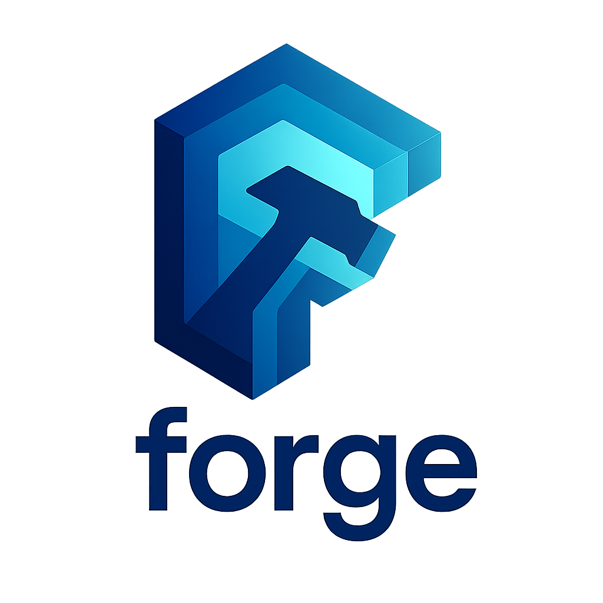

<p align="center">
  
</p>

# Forge

A CLI for automated git version tagging and changelog generation. Supports SemVer, CalVer, and monorepo workflows.

I built this for my personal projects to handle versioning without the hassle.

## What It Does

- **Version Management**: SemVer and CalVer (with ISO week support)
- **Hotfix Workflow**: Safe patching of released versions with dedicated branches
- **Monorepo Support**: Per-app versioning with namespaced tags
- **Changelog Generation**: Parses conventional commits
- **Interactive CLI**: Quick bumps with Bubble Tea UI
- **Build & Docker**: Basic cross-compilation and image builds

> **Note on Builds**: I highly recommend using [GoReleaser](https://goreleaser.com) for production builds. The build features here are basic and meant for my personal projects. Forge excels at version management - use it for tagging, then let GoReleaser handle the heavy lifting.

> **⚠️ ALPHA Features**: The `pre` (prerelease) and `meta` (build metadata) configuration options are in early alpha state and not fully implemented. Do not use these in production environments.

## Quick Start

```bash
# Install
go install github.com/alexjoedt/forge@latest

# Initialize
forge init

# Bump version (interactive)
forge bump

# Or direct
forge bump minor --push
```

## Core Commands

```bash
forge bump [major|minor|patch]    # Create version tag
forge hotfix create <tag>         # Create hotfix branch from release
forge hotfix bump                 # Bump hotfix version
forge hotfix status               # Show hotfix branch status
forge version                     # Show current version(s)
forge changelog                   # Generate changelog
forge validate                    # Check config and git state
forge build                       # Simple cross-compilation (use GoReleaser instead)
forge docker                      # Build Docker images
```

## Configuration

Minimal `forge.yaml`:

```yaml
version:
  scheme: semver    # or: calver
  prefix: v

git:
  tag_prefix: v
  default_branch: main
```

Monorepo:

```yaml
defaultApp: api

api:
  version:
    scheme: semver
    prefix: v
  git:
    tag_prefix: api/v
    default_branch: main

worker:
  version:
    scheme: calver
    calver_format: "2006.WW"  # Year.Week
  git:
    tag_prefix: worker/
    default_branch: main
```

## Workflow

### Normal Development

```bash
# Make changes
git commit -m "feat: new feature"

# Tag version
forge bump minor --push

# Generate changelog
forge changelog --output CHANGELOG.md

# Build with GoReleaser (recommended)
goreleaser release
```

### Hotfix Workflow

```bash
# Production has v1.5.0, main is at v1.7.0
# Critical bug found in production

# Create hotfix branch from production tag
forge hotfix create v1.5.0

# Apply fixes and commit
git commit -m "fix: critical security issue"

# Create hotfix tag (v1.5.0-hotfix.1)
forge hotfix bump --push

# Check status anytime
forge hotfix status

# List all hotfixes for a version
forge hotfix list v1.5.0
```
